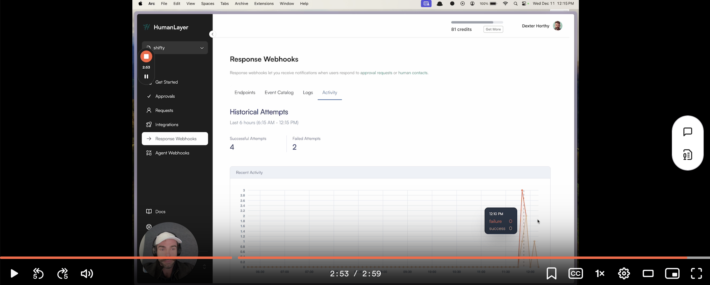
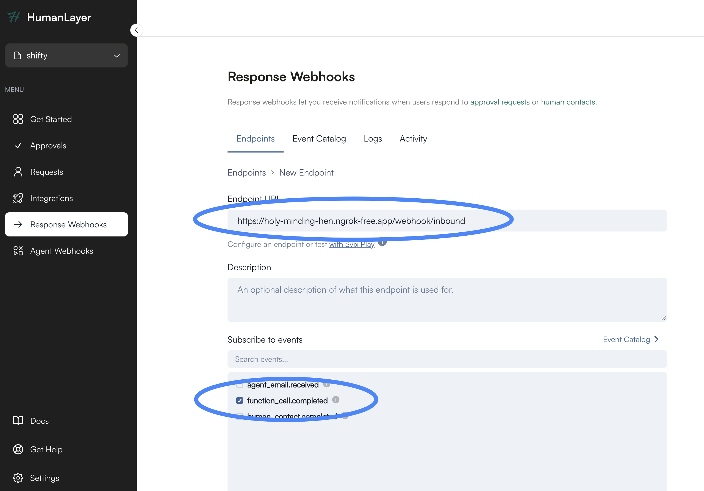
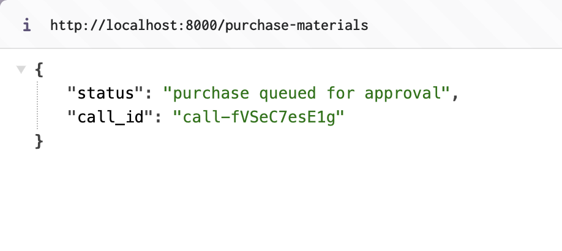
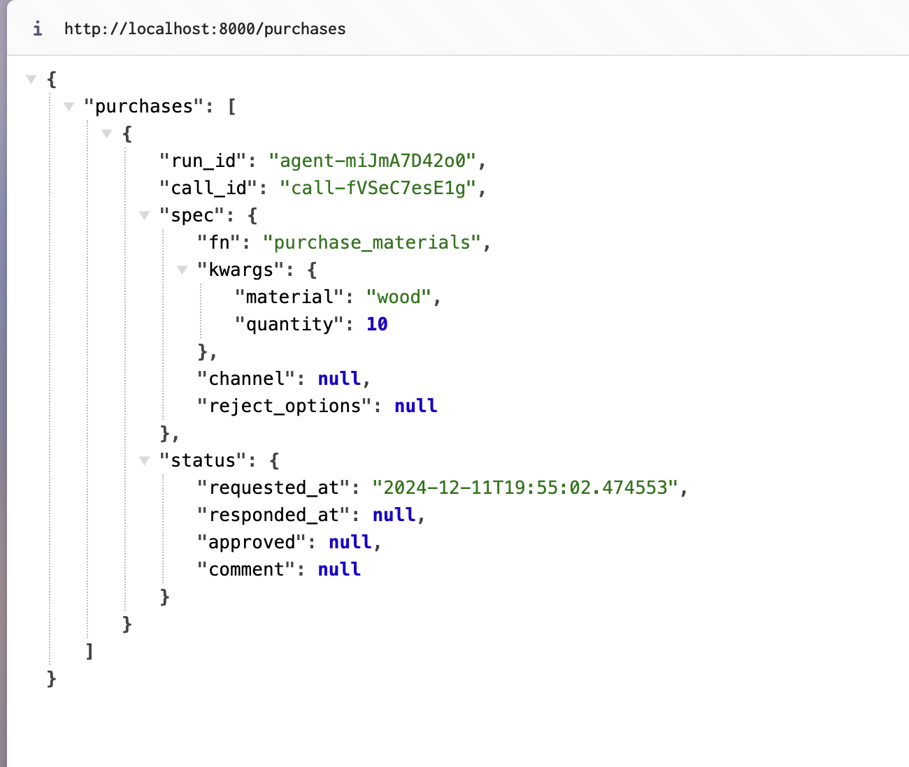
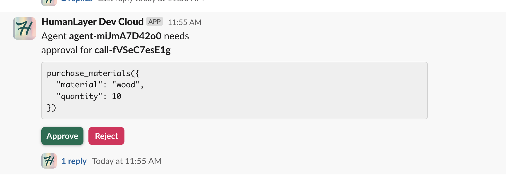
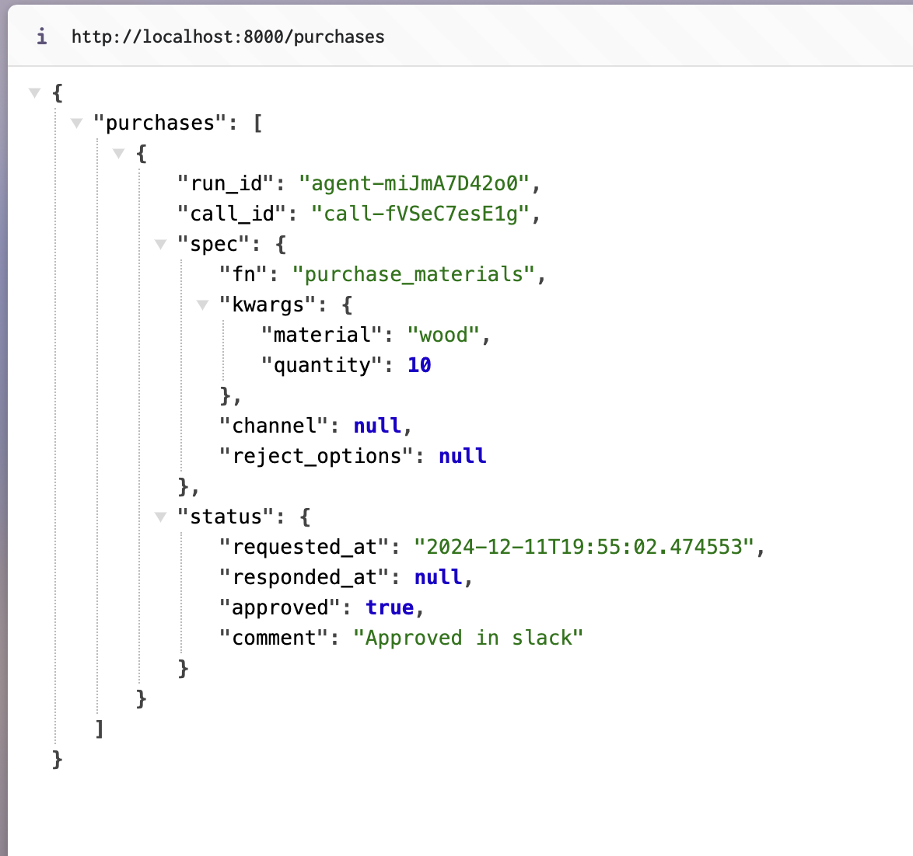
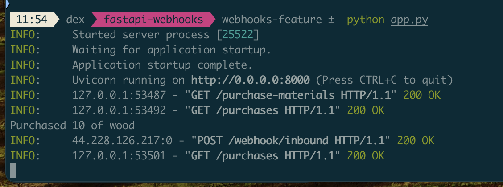

# HumanLayer FastAPI Webhooks Example

This example demonstrates how to use HumanLayer webhooks with FastAPI.

[](https://www.loom.com/share/e9a65173098749e2917d04bf0a6a56dc)

## Overview

This example uses a "purchase materials" endpoint that requires human approval.

The workflow is:

- open http://localhost:8000/purchase-materials
- this will create a pending approval in humanlayer for `{"material": "wood", "quantity": 10}`
- upon approval of the proposed action, a webhook will be sent to the `/webhook/inbound` endpoint
- if the action is approved, the purchase will be finalized

The server tracks the state of approvals in memory, you can view it at http://localhost:8000/purchases

This is obviously a bit of a toy example, but you can use it to see how webhooks work with HumanLayer.

## Setup

1. Create a virtual environment and activate it:

   ```bash
   python -m venv venv
   source venv/bin/activate  # On Windows: venv\Scripts\activate
   ```

2. Install dependencies:

   ```bash
   pip install -r requirements.txt
   ```

3. Copy `.env.example` to `.env` and fill in your API keys:

   ```bash
   cp .env.example .env
   # Add your keys to .env:
   # HUMANLAYER_API_KEY=your_key_here
   ```

4. Get an ngrok.com account and claim your free static subdomain.

5. Set up response webhooks in the HumanLayer saas

> https://your-subdomain.ngrok-free.app/webhook/inbound



## Running the Application

Start the server:

```bash
python app.py
# Or
uvicorn app:app --reload
```

In another terminal, run ngrok:

```bash
ngrok http 8000 --domain=your-subdomain.ngrok-free.app
```

## Step by step walkthough

1. Open http://localhost:8000/purchase-materials - this will queue a purchase for approval



2. Open http://localhost:8000/purchases - this will show the pending approval



3. Approve the purchase w/ HumanLayer - in this example we'll use the slack integration



4. Open http://localhost:8000/purchases - this will show the purchase was finalized



5. You can check the app logs to see that the webhook was received and the purchase was executed



The code that handles this is in app.py:

```python
@app.post("/webhook/inbound")
async def webhook_inbound(webhook: FunctionCall) -> Dict[str, str]:
    purchases[webhook.call_id] = webhook

    if webhook.status is not None and webhook.status.approved:
        finalize_purchase(webhook.spec.kwargs["material"], webhook.spec.kwargs["quantity"])
    else:
        print(f"Purchase {webhook.call_id} denied")

    return {"status": "ok"}
```
